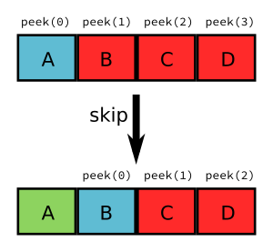

************
Architecture
************

Now that the minimal infrastructure is already set, we can start with the 
implementation of our tiny front end. Today we will talk about the lexer.

Typical compiler architecture
=============================

Since compilation is a lowering process, it makes sense to split the whole 
process in several steps. Each of these steps usually performs a single process. 
This is done because compilers quickly become untameable beasts. By splitting 
the compiler in several steps, it is easier to assign each step a specific 
and narrow task. This helps reasoning about the code and thus can minimize 
introducing bugs (or helps fixing them) and eases extending the compiler 
(this is actually commonplace software engineering good practice, but 
obviously applies to compilers as well).

Almost every compilation infrastructure like GCC, LLVM, Open64, ... is 
split in two big parts. The front end (what we are implementing) and the 
back end. The front end is responsible of recognizing the source language 
and diagnosing syntactic and semantic errors. The back end is responsible 
for generating code for the specific target (i.e. the environment and architecture). 
Nowadays compilers are in general optimizing compilers (a misnomer since they 
should be called enhancing compilers) this means thay they try to generate 
code that makes the most of the properties of the program (machine-independent 
optimizations) and the target where the program is going to run (machine-dependent 
optimizations). While machine-independent optimizations can be done in the f
ront end this would make them language-specific. This is undesirable, so most 
compilation infrastructures have an extra part between the front end and the 
back end that sometimes is called the middle end.

Since the process sequentially flows from the front end to the middle end 
and from that to the back end, there must be a way for each two to communicate. 
Compilers use what is commonly called intermediate representations. 
An intermediate representation is a more or less abstract representation of 
the program. At the early stages of the compilation process, the representation 
is very abstract and high level, pretty close to the programming language. 
As the compilation process goes on, the intermediate representation becomes more 
and more low level, until it is almost assembler or machine code. It is not
unusual that compilers have several intermediate representations. Sometimes 
it is the same representation simply restricted to a lower level subset. 
Sometimes is an entirely different representation. It may even happen that 
some optimizations require additional intermediate representations that a
re built only for them.

In GCC, a front end can use whatever representation it wants but at the end, 
before handing out the code to the rest of the compilation process, it has 
to be lowered into something called GENERIC. GENERIC is a tree-like r
epresentation and it is used in the front end and some early steps in the 
middle end of GCC. As a front end we only have to care to be able to deliver 
sensible GENERIC to the rest of the compiler.

But before we can create any GENERIC we first have to deal with the source code.

Open the file
=============

Before we do anything let's modify our parse hook in gcc-src/gcc/tiny/tiny1.cc 
so we open the input file and so we can later analyze it.

.. code-block:: c

    static void
    tiny_parse_file (const char *filename)
    {
    FILE *file = fopen (filename, "r");
    if (file == NULL)
        {
        fatal_error (UNKNOWN_LOCATION, "cannot open filename %s: %m", filename);
        }

    // Here we will analyze our file

    fclose (file);
    }

    static void
    tiny_parse_files (int num_files, const char **files)
    {
    for (int i = 0; i < num_files; i++)
        {
        tiny_parse_file (files[i]);
        }
    }

    static void
    tiny_langhook_parse_file (void)
    {
    tiny_parse_files (num_in_fnames, in_fnames);
    }

This still does nothing useful but at least defines a placeholder where the 
analysis starts. Note the usage of globals num_in_fnames and in_fnames in 
tiny_langhook_parse_file that contain the number of files we are going to 
compile. Although we do not mind the number of parameters in tiny_parse_files 
our examples will have just a single file. In function tiny_parse_file now 
we just open the input file but the analysis will happen there.

Typical front end design
========================

Nowadays front ends are commonly designed with three components: the lexical 
analyzer, the syntactic analyzer and the semantic analyzer. This is consistent 
with the strategy of splitting the compiler in smaller parts so they are 
manageable.

The lexical analyzer takes the input and splits into the constitutive parts 
of the language (i.e. the lexical elements) called tokens. The lexical analyzer 
is commonly called the lexer, the scanner or the tokenizer. Conceptually 
constructs a sequence of tokens of the program and nothing else.

This sequence of tokens is consumed by the syntactic analyzer. The syntactic 
analyzer verifies that the order of the tokens is such that it represents a 
(syntactically) valid program. The semantic analyzer still has to verify 
that a (syntactically) valid sequence of tokens adheres to the rules of 
the language. The term parser is commonly used to encompass the three 
processes of lexical, syntactic and semantic analysis.

Lexical analysis
================

Back to tiny, the tokens of the language more or less correspond to the 
elements in black bold face in the rules of :ref:`part01`, this is, all what 
appears in the right hand side of a rule and is not like 〈this〉. The 
following elements of the program will be analyzed by the lexer as 
tokens.

.. code-block:: c

    var write ; +

Some other tokens will not directly correspond to these elements, 
but a sequence of them. Identifiers, integer literals, string literals, 
can be understood as tokens on their own. The reason is that there is 
little value in keeping them split in their constituents.

.. code-block:: c

    123 123.456 "hello" foo

For instance, the first three lines of the following tiny program 
(assume it is in a file sum.tiny)

.. code-block:: c
    :linenos:

    var i : int;
    var s : int;
    s := 0;
    for i := 1 to 10 do
      s := s + i;
    end
    write s;

will be tokenized like this.

VAR IDENTIFIER COLON INT SEMICOLON VAR IDENTIFIER COLON INT SEMICOLON IDENTIFIER ASSIG INTEGER_LITERAL SEMICOLON

For each token we will want a bit more of information. In particular, 
IDENTIFIER tokens and INTEGER_LITERAL, among others, should have at least 
their associated text. For diagnostic purposes, we will also want to keep 
track of the location of each token inside the input. So we will also 
associate a file, line and column (called a location or locus). The above 
sequence of tokens would actually be more like

- id=VAR, file=sum.tiny, line=1, col=1 
- id=IDENTIFIER, file=sum.tiny, line=1, col=5, text=i
- id=COLON, file=sum.tiny, line=1, col=7 
- id=INT, file=sum.tiny, line=1, col=9 
- id=SEMICOLON, file=sum.tiny, line=1, col=12 
- id=VAR, file=sum.tiny, line=2, col=1 
- id=IDENTIFIER, file=sum.tiny, line=2, col=5, text=s 
- id=COLON, file=sum.tiny, line=2, col=7 
- id=INT, file=sum.tiny, line=2, col=9 
- id=SEMICOLON, file=sum.tiny, line=2, col=12 
- id=IDENTIFIER, file=sum.tiny, line=3, col=1, text=s 
- id=ASSIG, file=sum.tiny, line=3, col=3 
- id=INTEGER_LITERAL, file=sum.tiny, line=2, col=6, text=0 
- id=SEMICOLON, file=sum.tiny, line=3, col=7

Tokens
------

What is a token? It is conceptually a tuple of what a token can have: the 
kind of the token, its location and a text (if any).

.. code-block:: c

    struct Token
    {
    private:
    TokenId token_id;
    location_t locus;
    std::string *str;
    ...
    };

Field token_id will store the kind of token, locus will keep the location 
(more on this below) and str will keep an associated text, if any, of the 
token.

Field token_id has type TokenId that is nothing but an enum of the kinds 
of tokens we have.

.. code-block:: c

    enum TokenId
    {
    ...
    };

The enum would contain all the token kinds as enumerators. We can write them 
manually but this quickly becomes tedious. Instead we will use 
`X-Macros <https://en.wikipedia.org/wiki/X_Macro>`_
. This way we can describe our tokens in one place and the data structures will be 
updated automatically. We will use this technique several times in our front 
end to ease maintaining. Of course other code-generating approaches (like 
using small DSLs like 
`GNU M4 <http://www.gnu.org/software/m4/>`_
) can be used instead, this one is enough for 
most of our needs.

.. code-block:: c

    // TINY_TOKEN(name, description)
    // TINY_TOKEN_KEYWORD(name, identifier)
    //
    // Keep TINY_TOKEN_KEYWORD sorted

    #define TINY_TOKEN_LIST                                                        \
    TINY_TOKEN (FIRST_TOKEN, "<first-token-marker>")                             \
    TINY_TOKEN (END_OF_FILE, "end of file")                                      \
    TINY_TOKEN (ASSIG, ":=")                                                     \
    TINY_TOKEN (ASTERISK, "*")                                                   \
    TINY_TOKEN (COLON, ":")                                                      \
    TINY_TOKEN (DIFFERENT, "!=")                                                 \
    TINY_TOKEN (EQUAL, "=")                                                      \
    TINY_TOKEN (LEFT_PAREN, "(")                                                 \
    TINY_TOKEN (MINUS, "-")                                                      \
    TINY_TOKEN (PLUS, "+")                                                       \
    TINY_TOKEN (RIGHT_PAREN, ")")                                                \
    TINY_TOKEN (SEMICOLON, ";")                                                  \
    TINY_TOKEN (SLASH, "/")                                                      \
    TINY_TOKEN (PERCENT, "%")                                                    \
    TINY_TOKEN (GREATER, ">")                                                    \
    TINY_TOKEN (GREATER_OR_EQUAL, ">=")                                          \
    TINY_TOKEN (LOWER, "<")                                                      \
    TINY_TOKEN (LOWER_OR_EQUAL, "<=")                                            \
    TINY_TOKEN (IDENTIFIER, "identifier")                                        \
    TINY_TOKEN (INTEGER_LITERAL, "integer literal")                              \
    TINY_TOKEN (REAL_LITERAL, "real literal")                                    \
    TINY_TOKEN (STRING_LITERAL, "string literal")                                \
                                                                                \
    TINY_TOKEN_KEYWORD (AND, "and")                                              \
    TINY_TOKEN_KEYWORD (DO, "do")                                                \
    TINY_TOKEN_KEYWORD (ELSE, "else")                                            \
    TINY_TOKEN_KEYWORD (END, "end")                                              \
    TINY_TOKEN_KEYWORD (FLOAT, "float")                                          \
    TINY_TOKEN_KEYWORD (FOR, "for")                                              \
    TINY_TOKEN_KEYWORD (IF, "if")                                                \
    TINY_TOKEN_KEYWORD (INT, "int")                                              \
    TINY_TOKEN_KEYWORD (NOT, "not")                                              \
    TINY_TOKEN_KEYWORD (OR, "or")                                                \
    TINY_TOKEN_KEYWORD (READ, "read")                                            \
    TINY_TOKEN_KEYWORD (THEN, "then")                                            \
    TINY_TOKEN_KEYWORD (TO, "to")                                                \
    TINY_TOKEN_KEYWORD (VAR, "var")                                              \
    TINY_TOKEN_KEYWORD (WHILE, "while")                                          \
    TINY_TOKEN_KEYWORD (WRITE, "write")                                          \
                                                                                \
    TINY_TOKEN (LAST_TOKEN, "<last-token-marker>")

    enum TokenId
    {
    #define TINY_TOKEN(name, _) name,
    #define TINY_TOKEN_KEYWORD(x, y) TINY_TOKEN (x, y)
    TINY_TOKEN_LIST
    #undef TINY_TOKEN_KEYWORD
    #undef TINY_TOKEN
    };

What we do is we define a macro TINY_TOKEN_LIST using undefined macros 
inside. Right before using the list we define these, in this case TINY_TOKEN 
and TINY_TOKEN_KEYWORD, to what we need. For this specific case, this will 
fill our enum TokenId with the first parameter of the macro, that we chose 
to use as the enumerator name. Note that we distinguish plain tokens from 
keyword tokens using TINY_TOKEN_KEYWORD instead of TINY_TOKEN. Later on we 
will see why.

The expansion of the above X-Macro will generate something like the f
ollowing. This is what we wanted but we do not have to write it manually.

.. code-block:: c

    enum TokenId
    {
    FIRST_TOKEN,
    END_OF_FILE,
    ASSIG,
    // ... etcetera ...
    WRITE,
    LAST_TOKEN
    };

We will also use this technique to create a function that returns a 
descriptive text for a given token kind.

.. code-block:: c

    const char *
    get_token_description (TokenId tid)
    {
    switch (tid)
        {
    #define TINY_TOKEN(name, descr)                 \
    case name                                       \
        return descr;
    #define TINY_TOKEN_KEYWORD(x, y) TINY_TOKEN (x, y)
        TINY_TOKEN_LIST
    #undef TINY_TOKEN_KEYWORD
    #undef TINY_TOKEN
        default:
        gcc_unreachable ();
        }
    }

And we will also create a debugging function that given a token_id 
will return its token kind as a string (i.e. given the token kind 
ASSIG this function will return the string "ASSIG").

.. code-block:: c

    const char *
    token_id_to_str (TokenId tid)
    {
    switch (tid)
        {
    #define TINY_TOKEN(name, _)                                                    \
    case name:                                                                   \
        return #name;
    #define TINY_TOKEN_KEYWORD(x, y) TINY_TOKEN (x, y)
        TINY_TOKEN_LIST
    #undef TINY_TOKEN_KEYWORD
    #undef TINY_TOKEN
        default:
        gcc_unreachable ();
        }
    }

Since we do not want to create tokens directly using the constructors 
we will create them using factory functions. Most tokens will simply 
be created with a token id and a location but some of them have will 
have an associated text. The factories are make, make_identifier, 
make_integer, make_real and make_string.

.. code-block:: c

    struct Token
    {
    private:
    // ...

    Token (TokenId token_id_, location_t locus_)
        : token_id (token_id_), locus (locus_), str (NULL)
    {
    }
    Token (TokenId token_id_, location_t locus_, const std::string& str_)
        : token_id (token_id_), locus (locus_), str (new std::string (str_))
    {
    }
    
    // No default initializer
    Token ();
    // Do not copy/assign tokens
    Token (const Token &);
    Token &operator=(const Token &);
    
    public:
    static TokenPtr
    make (TokenId token_id, location_t locus)
    {
        return TokenPtr(new Token (token_id, locus));
    }
    
    static TokenPtr
    make_identifier (location_t locus, const std::string& str)
    {
        return TokenPtr(new Token (IDENTIFIER, locus, str));
    }
    
    static TokenPtr
    make_integer (location_t locus, const std::string& str)
    {
        return TokenPtr(new Token (INTEGER_LITERAL, locus, str));
    }
    
    static TokenPtr
    make_real (location_t locus, const std::string& str)
    {
        return TokenPtr(new Token (REAL_LITERAL, locus, str));
    }

    // ...
    };

These factories return smart pointers to Token because the lifetime 
of a token is not obvious and we want to clean up them anyway when 
they are not used anymore.

.. code-block:: c

    #include <tr1/memory>

    struct Token;
    typedef std::tr1::shared_ptr<Token> TokenPtr;
    typedef std::tr1::shared_ptr<const Token> const_TokenPtr;

Type const_TokenPtr will be used later in the lexer. We have to use C++03 
TR1 because gcc is written in C++03 not C++11 (in C++11 we would use the 
standard memory header and std::shared_ptr template instead)

.. TODO: Add references to GCC Tiny github for the files.

The complete implementation of the class Token is in files 
gcc-src/gcc/tiny/tiny-token.h and gcc-src/gcc/tiny/tiny-token.cc

Lexer operation
===============

Conceptually a lexer returns the sequence of tokens of our input. Building 
such sequence as a whole would force us to temporarily store it in memory. 
This would work but it is not particularly efficient because input files 
may easily have thousands of tokens and we are going to analyze them more 
or less sequentially. A lexer that returns a stream of tokens will have 
lower memory requirements.

This means that the lexer will always return a single token. It will 
return the current one unless we tell the lexer to advance to the next 
token (going backwards is out of question). This suggests that our lexer 
must support a get operation that returns the current token and a skip 
operation that advances the current token to the next one (skip does 
not return anything). Sometimes we can even mix the two operations in 
a single get operation that, at the same time, returns the current 
token and skips it.

This stream-like approach saves memory but now we have made our life 
a bit harder. Sometimes (this will be more evident during syntactic 
analysis) we may need to peek a few tokens ahead. With the get/skip 
interface above it will be responsibility of the user of the lexer 
to keep track of tokens peeked ahead. While this is doable it may be 
a bit unwieldy. So our lexer should support peeking n tokens ahead. 
If n is zero this is the same as the current token, so we can make 
our lexer to have two operations peek(n) and skip. Note that there 
is no real need of skip(n) since this can easily be achieved by 
calling n times skip (although it may be handy having it).

For theoretical reasons out of the scope of this post, our front end 
should not do unbounded peeks. This means that, ideally, all peek(n) 
operations should receive an n value known at compile time. For the 
sake of simplicity, though, our implementation will allow unbounded 
peeks.

The two operations that the lexer can do (peek and skip) remind us 
of a queue. When we peek a token, if it is not in the queue it will 
be added to the back of the queue, otherwise the token in the queue 
will be used. Skip simply removes an item from the front of the queue. 
Recall that peek(0) is the current token and skip will advance the 
token stream. This means that the token returned by peek(n+1) before 
skip, will be returned by peek(n) after the skip.

.. Add picture lexer-input https://thinkingeek.com/wp-content/uploads/2016/01/lexer-input.png

Lexer interface
===============

Our lexer interface will look like this.

.. code-block:: c

    struct Lexer
    {
    public:
    Lexer (const char *filename, FILE *input);
    ~Lexer ();

    const_TokenPtr peek_token () { return peek_token(0); }
    const_TokenPtr peek_token (int);

    void skip_token () { return skip_token(0); }
    void skip_token (int);
    private:
    ...
    };

Basically we will pass to the lexer the input file (and the filename, 
for location tracking purposes) and then we have the two operations 
described above now renamed as peek_token and skip_token.

Where do we get the tokens from? Well, before we can form a token we 
have to somehow read the input file. We can view the input file 
similar to a stream of tokens but this time it will be a stream of 
characters. We will group them into tokens. This suggests that the 
idea of peek(n) and skip can be applied to the FILE*. So it seems 
a good idea to abstract this away in a template class buffered_queue.

.. code-block:: c

    template <typename T, typename Source> struct buffered_queue
    {

The template parameter T will be the type of items stored in our queue. 
For the input file it will be char (although we will use int for a reason 
explained below). For the tokens themselves it will be TokenPtr. Source 
is a class type that implements the function call operator. This 
operator must return a T value. It will be invoked during peek(n) 
n refers to an element that is not yet in the queue.

The function call operator for the input file will basically invoke fgetc. 
This function returns an unsigned char casted into a int because of the 
EOF marker used to mark end of file. This is the reason why our buffered_queue 
for the input file will store int rather than char. For the stream of 
tokens the function call operator will just build the next token using 
the input, we will see later how we build the token.

.. code-block:: c

    struct Lexer
    {
    // ...
    private: 
    struct InputSource
    {
        FILE *input;
        InputSource (FILE *input_) : input (input_) {}
        int operator() () { return fgetc (input); }
    };
    InputSource input_source;
    buffered_queue<int, InputSource> input_queue;

    struct TokenSource
    {
        Lexer *lexer;
        TokenSource (Lexer *lexer_) : lexer (lexer_) {}
        TokenPtr operator() () { return lexer->build_token (); }
    };

    TokenSource token_source;
    buffered_queue<std::tr1::shared_ptr<Token>, TokenSource> token_queue;
    };

Data members input_queue and token_queue implement respectively the buffered 
queues of the input file and the stream of tokens.

.. TODO: add link to gcc tiny github

The implementation of buffered_queue is a bit long to paste it here. It is in 
gcc-src/gcc/tiny/tiny-buffered-queue.h. It is implemented using a std::vector 
and two position markers: start and end. When start == end it means that the 
queue is empty. Member function skip just advances start, calling peek if we 
are actually skiping more than what was peeked so far. If it becomes the same 
as end, it just moves both to the beginning of the vector, this way the vector 
does not have to grow indefinitely. Member function peek checks if the requested 
n is already in the queue, if it is, it just returns it. If it is not it will 
call Source::operator(), but before that it checks if there is enough room in 
the vector. If there is not, then a larger vector is allocated, data is copied 
and the new vector is now used as the buffer. There is room for improvement for 
this class. For instance we may try to compact the vector before reallocating 
because the space may already be there just we are too near the end of the vector, 
etc. But I think it is good enough for us now.

Now we can see the implementation of peek_token and skip_token.

.. code-block:: c

    const_TokenPtr
    Lexer::peek_token (int n)
    {
    return token_queue.peek (n);
    }

    void
    Lexer::skip_token (int n)
    {
    token_queue.skip (n);
    }

This way the token will be formed during the call to token_queue.peek . 
It will invoke SourceToken::operator() which ends calling Lexer::build_token. 
So now it is time to see how a token is formed.

.. code-block:: c

    TokenPtr
    Lexer::build_token ()
    {
    for (;;)
        {
        location_t loc = get_current_location ();
        int current_char = peek_input ();
        skip_input ();

        // ... rest of the code ...
        }
    }

Before we discuss the main loop, note that the body of the loop calls 
peek_input and skip_input. These two functions use the input_queue.

.. code-block:: c

    int
    Lexer::peek_input (int n)
    {
    return input_queue.peek (n);
    }

    void
    Lexer::skip_input (int n)
    {
    input_queue.skip (n);
    }

Similar to what happened with token_queue, input_queue will invoke 
InputSource::operator() which simply calls fgetc, effectively returning 
us the current character of the file (until we skip it, of course).

So, why is there a loop in Lexer::build_token? Because we may have to 
advance several characters of the input before we can form a token. 
When a token is formed, we will simply return from the function. While 
we cannot form it (for instance when we encounter whitespace or newlines)
we will just keep requesting characters. Of course there must be a way 
of finishing the loop: when we find the end of file we will just build 
the END_OF_FILE token and stop processing the input.

.. code-block:: c
    :lineno-start: 107

    TokenPtr
    Lexer::build_token ()
    {
    for (;;)
        {
        location_t loc = get_current_location ();
        int current_char = peek_input ();
        skip_input ();

        if (current_char == EOF)
        {
        return Token::make (END_OF_FILE, loc);
        }
        // ...
    }

If the character read from the input is not the END_OF_FILE we can start tokenizing it. We have to ignore 
whitespace by not forming a token but we still have to update location information.

	
.. code-block:: c
    :lineno-start: 121

    switch (current_char)
	{
	// **************
	// * Whitespace *
	// **************
	case '\n':
	  current_line++;
	  current_column = 1;
	  linemap_line_start (::line_table, current_line, max_column_hint);
	  continue;
	case ' ':
	  current_column++;
	  continue;
	case '\t':
	  // Width of a tab is not well defined, let's assume 8 for now
	  current_column += 8;
	  continue;

As you can see we have two data members current_line and current_column 
that we have to update for proper location tracking. Let's ignore for 
now the line 129, more on this later.

Now we can start matching punctuation. Some tokens are straightforward.

.. code-block:: c
    :lineno-start: 171

	case '=':
	  current_column++;
	  return Token::make (EQUAL, loc);
	case '(':
	  current_column++;
	  return Token::make (LEFT_PAREN, loc);
	case '-':
	  current_column++;
	  return Token::make (MINUS, loc);
	case '+':
	  current_column++;
	  return Token::make (PLUS, loc);
	case ')':
	  current_column++;
	  return Token::make (RIGHT_PAREN, loc);
	case ';':
	  current_column++;
	  return Token::make (SEMICOLON, loc);

Some others may require a bit of peeking, but that's all.

.. code-block:: c
    :lineno-start: 189

	case '<':
	  if (peek_input () == '=')
	    {
	      skip_input ();
	      current_column += 2;

	      return Token::make (LOWER_OR_EQUAL, loc);
	    }
	  else
	    {
	      current_column++;
	      return Token::make (LOWER, loc);
	    }
	  break;

If you wonder how comments are implemented: the lexer just skips over it.

.. code-block:: c
    :lineno-start: 223

	case '#': /* comment */
	  current_column++;
	  current_char = peek_input ();
	  while (current_char != '\n')
	    {
	      skip_input ();
	      current_column++; // won't be used
	      current_char = peek_input ();
	    }
	  continue;
	  break;

If we reach the end of the loop and the character has not been handled, 
it means that the character is invalid. Function error_at is a diagnostic 
utility from GCC that we will see again during syntactic analysis, so 
let's ignore it from now.

.. code-block:: c
    :lineno-start: 335

      // Martians
      error_at (loc, "unexpected character '%x'", current_char);
      current_column++;

.. TODO: Add link to gcc tiny's https://github.com/rofirrim/gcc-tiny/blob/master/gcc/tiny/tiny-lexer.cc#L121

And so on. See the full listing here. It may seem tedious but it only 
has to be written once and after that it is relatively easy to extend.

Identifiers and keywords
------------------------

Identifiers and keywords are interesting because they share some lexical form. 
As we specified in part 1, if an identifier may be a keyword it is tokenized 
as a keyword. This means that whil is an IDENTIFIER but while is the token WHILE. 
So what we do is we just gather the text of the token and check if it is an 
keyword. If it is, we form the corresponding keyword token, otherwise we 
form an identifier token.

.. code-block:: c
    :lineno-start: 237

      // ***************************
      // * Identifiers or keywords *
      // ***************************
      if (ISALPHA (current_char) || current_char == '_')
	{
	  std::string str;
	  str.reserve (16); // some sensible default
	  str += current_char;

	  int length = 1;
	  current_char = peek_input ();
	  while (ISALPHA (current_char) || ISDIGIT (current_char)
		 || current_char == '_')
	    {
	      length++;

	      str += current_char;
	      skip_input ();
	      current_char = peek_input ();
	    }

	  current_column += length;

	  TokenId keyword = classify_keyword (str);
	  if (keyword == IDENTIFIER)
	    {
	      return Token::make_identifier (loc, str);
	    }
	  else
	    {
	      return Token::make (keyword, loc);
	    }
	}

Macros ISALPHA and ISDIGIT are provided by the gcc header safe-ctype.h and 
check if a character belongs to the set of alphanumeric letters or decimal 
digits, respectively. The function classify_keyword is implemented by 
doing a binary search in a sorted array of keywords. This sorted array is 
defined using X-Macros, here we use only TINY_TOKEN_KEYWORD and we ignore 
the remaining tokens.
	
.. code-block:: c
    :lineno-start: 64

    namespace
    {

    const std::string keyword_index[] = {
    #define TINY_TOKEN(x, y)
    #define TINY_TOKEN_KEYWORD(name, keyword) keyword,
    TINY_TOKEN_LIST
    #undef TINY_TOKEN_KEYWORD
    #undef TINY_TOKEN
    };

    TokenId keyword_keys[] = {
    #define TINY_TOKEN(x, y)
    #define TINY_TOKEN_KEYWORD(name, keyword) name,
    TINY_TOKEN_LIST
    #undef TINY_TOKEN_KEYWORD
    #undef TINY_TOKEN
    };

    const int num_keywords = sizeof (keyword_index) / sizeof (*keyword_index);
    }

What we do here is declaring two parallel arrays. The first one, keyword_index, 
is just an array of std::string with one element per keyword. Since 
TINY_TOKEN_KEYWORDs are sorted by keyword inside TINY_TOKEN_LIST this array 
will be sorted too. The second array, keyword_keys, contains the token ids 
for the corresponding tokens in keyword_index. Then our function 
classify_keyword just looks up a string in keyword_index. If it finds it 
ses the position of the keyword to index keyword_keys.

	
.. code-block:: c
    :lineno-start: 86

    TokenId
    Lexer::classify_keyword (const std::string &str)
    {
    const std::string *last = keyword_index + num_keywords;
    const std::string *idx = std::lower_bound (keyword_index, last, str);

    if (idx == last || str != *idx)
        return IDENTIFIER;
    else
        {
        return keyword_keys[idx - keyword_index];
        }
    }

Tracking location
=================

Tracking location can be implemented manually but GCC has good support in this 
area so it would be a pity not to use it.

GCC has a global variable called line_table responsible for tracking locations. 
We have to tell line_table when we enter a file and when we leave it (this is 
useful for include-like constructions since line_table will keep track of 
this). We do this in the constructor of Lexer.

.. code-block:: c

    Lexer::Lexer (const char *filename, FILE *input_)
    : input (input_), current_line (1), current_column (1), line_map (0),
        input_source (input), input_queue (input_source), token_source (this),
        token_queue (token_source)
    {
    line_map = ::linemap_add (::line_table, ::LC_ENTER,
                    /* sysp */ 0, filename,
                    /* current_line */ 1);
    }

Function linemap_add informs line_table that we are entering a file (LC_ENTER) 
and that we are in line 1. When forming a token, we have to get the location. 
We did this calling Lexer::get_current_location (see above). It simply requests 
a new location_t for the current column.

.. code-block:: c

    location_t
    Lexer::get_current_location ()
    {
    return ::linemap_position_for_column (::line_table, current_column);
    }

When a newline is encountered, we have to tell line_table that a new line 
starts. We already did this in build_token.

.. code-block:: c
    :lineno-start: 123

	// **************
	// * Whitespace *
	// **************
	case '\n':
	  current_line++;
	  current_column = 1;
	  linemap_line_start (::line_table, current_line, max_column_hint);
	  continue;

Current layout
--------------

Our gcc-src/gcc/tiny now looks like this

.. code-block::

    gcc-src/gcc/tiny
    ├── config-lang.in
    ├── lang-specs.h
    ├── Make-lang.in
    ├── tiny1.cc
    ├── tiny-buffered-queue.h
    ├── tiny-lexer.cc
    ├── tiny-lexer.h
    ├── tinyspec.cc
    ├── tiny-token.cc
    └── tiny-token.h

Trying our lexer
----------------

Ok, now we have a lexer, let's try it. First let's build the 
new files. Let's update gcc-src/gcc/tiny/Make-lang.in.

.. code-block:: makefile

    tiny_OBJS = \
        tiny/tiny1.o \
        tiny/tiny-token.o \
        tiny/tiny-lexer.o \
        $(END)

Now let's change tiny_parse_file in gcc-src/gcc/tiny/tiny1.cc.

.. code-block:: c

    static void
    tiny_parse_file (const char *filename)
    {
    FILE *file = fopen (filename, "r");
    if (file == NULL)
        {
        fatal_error (UNKNOWN_LOCATION, "cannot open filename %s: %m", filename);
        }

    // Here we would parse our file
    Tiny::Lexer lex (filename, file);

    Tiny::const_TokenPtr tok = lex.peek_token ();
    for (;;)
        {
        bool has_text = tok->get_id () == Tiny::IDENTIFIER
                || tok->get_id () == Tiny::INTEGER_LITERAL
                || tok->get_id () == Tiny::REAL_LITERAL
                || tok->get_id () == Tiny::STRING_LITERAL;

        location_t loc = tok->get_locus ();

        fprintf (stderr, "<id=%s%s, %s, line=%d, col=%d>\n", tok->token_id_to_str (),
            has_text ? (std::string(", text=") + tok->get_str ()).c_str () : "",
            LOCATION_FILE (loc), LOCATION_LINE (loc), LOCATION_COLUMN (loc));

        if (tok->get_id() == Tiny::END_OF_FILE)
            break;

        lex.skip_token ();
        tok = lex.peek_token ();
        }

    fclose (file);
    }

After the customary make and make install we can test with the example of sum.tiny.

.. code-block:: shell-session

    $ ./gcc-install/bin/gcctiny -c sum.tiny
    <id=VAR, sum.tiny, line=1, col=1>
    <id=IDENTIFIER, text=i, sum.tiny, line=1, col=5>
    <id=COLON, sum.tiny, line=1, col=7>
    <id=INT, sum.tiny, line=1, col=9>
    <id=SEMICOLON, sum.tiny, line=1, col=12>
    <id=VAR, sum.tiny, line=2, col=1>
    <id=IDENTIFIER, text=s, sum.tiny, line=2, col=5>
    <id=COLON, sum.tiny, line=2, col=7>
    <id=INT, sum.tiny, line=2, col=9>
    <id=SEMICOLON, sum.tiny, line=2, col=12>
    <id=IDENTIFIER, text=s, sum.tiny, line=3, col=1>
    <id=ASSIG, sum.tiny, line=3, col=3>
    <id=INTEGER_LITERAL, text=0, sum.tiny, line=3, col=6>
    <id=SEMICOLON, sum.tiny, line=3, col=7>
    <id=FOR, sum.tiny, line=4, col=1>
    <id=IDENTIFIER, text=i, sum.tiny, line=4, col=5>
    <id=ASSIG, sum.tiny, line=4, col=7>
    <id=INTEGER_LITERAL, text=1, sum.tiny, line=4, col=10>
    <id=TO, sum.tiny, line=4, col=12>
    <id=INTEGER_LITERAL, text=10, sum.tiny, line=4, col=15>
    <id=DO, sum.tiny, line=4, col=18>
    <id=IDENTIFIER, text=s, sum.tiny, line=5, col=3>
    <id=ASSIG, sum.tiny, line=5, col=5>
    <id=IDENTIFIER, text=s, sum.tiny, line=5, col=8>
    <id=PLUS, sum.tiny, line=5, col=10>
    <id=IDENTIFIER, text=i, sum.tiny, line=5, col=12>
    <id=SEMICOLON, sum.tiny, line=5, col=13>
    <id=END, sum.tiny, line=6, col=1>
    <id=WRITE, sum.tiny, line=7, col=1>
    <id=IDENTIFIER, text=s, sum.tiny, line=7, col=7>
    <id=SEMICOLON, sum.tiny, line=7, col=8>
    <id=END_OF_FILE, sum.tiny, line=8, col=1>

Yay!

Wrap-up
=======

Now that we are able to create the sequence of tokens of our input program we 
still have to verify that the sequence forms a syntactically valid program. 
But this will be in the next chapter. That's all for today.
